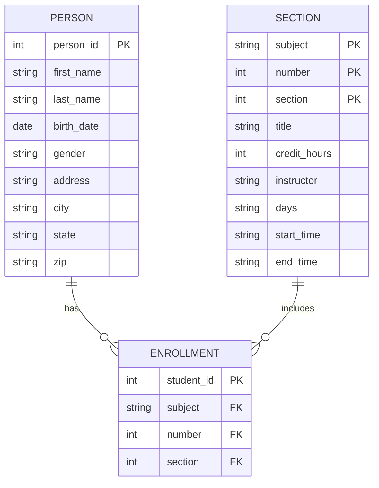

```mermaid
erDiagram
    PERSON ||--o{ ENROLLMENT : has
    SECTION ||--o{ ENROLLMENT : includes

    PERSON {
        int person_id PK
        string first_name
        string last_name
        date birth_date
        string gender
        string address
        string city
        string state
        string zip
    }

    SECTION {
        string subject PK
        int number PK
        int section PK
        string title
        int credit_hours
        string instructor
        string days
        string start_time
        string end_time
    }

    ENROLLMENT {
        int student_id PK
        string subject FK
        int number FK
        int section FK
    }
```

# project-2-week-3
